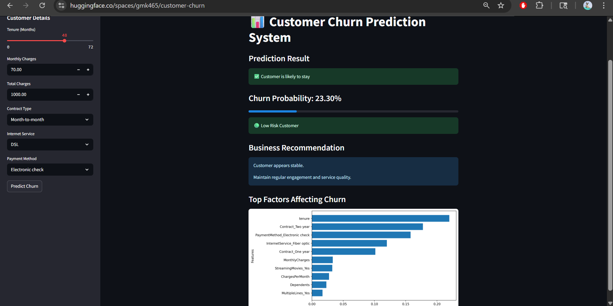

# 📊 Customer Churn Prediction System


🔗 **Hugging Face Deployment:**

[https://huggingface.co/spaces/gmk465/customer-churn](https://huggingface.co/spaces/gmk465/customer-churn)

---

# 📌 Project Overview

Customer churn is one of the biggest challenges faced by subscription-based businesses such as telecom companies, streaming platforms, SaaS products, and banking services.

This project predicts whether a customer is likely to churn based on customer behavior, service usage, payment methods, contract type, and billing information.

The application was built as a complete end-to-end Machine Learning project covering:

* Data Cleaning
* Exploratory Data Analysis (EDA)
* Feature Engineering
* Class Imbalance Handling
* Model Training & Evaluation
* Model Comparison
* Streamlit Web App Development
* Public Deployment using Hugging Face Spaces

---

# ✨ Features

 Predict customer churn probability
 Interactive Streamlit dashboard
 Real-time customer risk analysis
 Business recommendations based on churn risk
 Feature importance visualization
 Probability-based risk categorization
 Publicly deployed ML application

---

# 🖥️ Application Preview

## Main Dashboard




# 🧠 Machine Learning Workflow

## 1. Data Preprocessing

* Handled missing values
* Converted categorical variables
* Scaled numerical features
* Created additional engineered features

## 2. Feature Engineering

Custom features created:

* ChargesPerMonth
* IsNewCustomer
* IsHighSpender

## 3. Handling Class Imbalance

Used:

* SMOTE (Synthetic Minority Oversampling Technique)

## 4. Model Training

Models compared:

* Logistic Regression
* Random Forest Classifier
* Gradient Boosting Classifier

## 5. Best Performing Model

🏆 **Gradient Boosting Classifier** was selected as the final model based on overall performance.

---

# 📈 Technologies Used

| Category             | Tools                       |
| -------------------- | --------------------------- |
| Programming Language | Python                      |
| Data Analysis        | Pandas, NumPy               |
| Visualization        | Matplotlib, Seaborn, Plotly |
| Machine Learning     | Scikit-learn                |
| Imbalance Handling   | SMOTE                       |
| Model Serialization  | Joblib                      |
| Frontend             | Streamlit                   |
| Deployment           | Hugging Face Spaces         |
| Version Control      | Git & GitHub                |

---

# 📊 Prediction Output

The application provides:

* Churn prediction result
* Churn probability score
* Risk level classification
* Business recommendation
* Top features affecting churn

---

# 📂 Project Structure

```bash
customer-churn-prediction/
│
├── app.py
├── requirements.txt
├── README.md
├── screenshots
│
├── models/
│   ├── best_model.pkl
│   ├── scaler.pkl
│   └── model_columns.pkl
│
├── notebooks/
│   ├── 01_eda.ipynb
│   ├── 02_preprocessing.ipynb
│   └── 03_model_training.ipynb
│
└── data/
    └── churn.csv
```

---

# ⚙️ Installation

## Clone Repository

```bash
git clone https://github.com/your-username/Customer_Churn.git
```

## Navigate to Project

```bash
cd customer-churn-prediction
```

## Install Dependencies

```bash
pip install -r requirements.txt
```

## Run Streamlit App

```bash
streamlit run app.py
```

---

# 🎯 Business Impact

This system can help businesses:

* Identify customers at high risk of churn
* Improve customer retention strategies
* Reduce revenue loss
* Take proactive retention actions
* Improve customer engagement

---

# 🔮 Future Improvements

* Add SHAP explainability visualizations
* Deploy using Docker & CI/CD pipelines
* Integrate database support
* Add authentication system
* Improve mobile responsiveness
* Add advanced analytics dashboard

---

# 👨‍💻 Author

**Mohan Kalyan Guntupalli**
